# Weather Wisdom Explorer - Workflow

This document outlines the key workflows within the Weather Wisdom Explorer application, from user interaction to data processing and display.

## User Workflows

### Current Weather Search Workflow

1. **Location Search**
   - User enters a location name in the search field
   - Application provides autocomplete suggestions
   - User selects a location from the suggestions

2. **Current Weather Retrieval**
   - Application makes API request to fetch current weather data
   - Weather data is processed and displayed in the UI
   - Background changes to reflect current weather conditions

3. **Saving Weather Data**
   - User clicks "Save" button to store current weather data
   - Data is saved to local storage with a unique ID
   - Confirmation toast notification is displayed

**Workflow Diagram:**

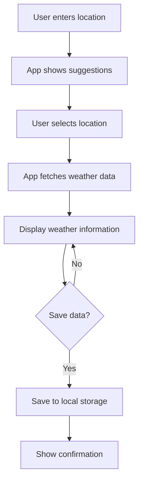

### Historical Weather Search Workflow

1. **Date Range Selection**
   - User selects a location (if not already selected)
   - User picks a date range using the date range picker
   - User clicks "Search" to retrieve historical data

2. **Historical Data Retrieval**
   - Application makes API request for the historical period
   - Data is processed and displayed in a table format
   - Charts are generated to visualize temperature trends

3. **Data Export**
   - User selects an export format (JSON, CSV, XML, PDF, MD)
   - Application processes and formats the data accordingly
   - Browser initiates a download of the exported file

**Workflow Diagram:**

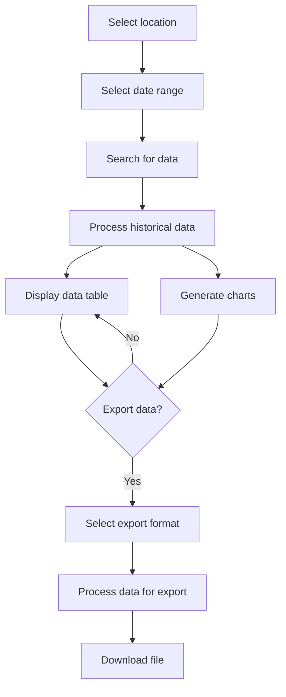

### Saved Weather Management Workflow

1. **Viewing Saved Records**
   - User navigates to the saved weather tab
   - Application retrieves all saved records from local storage
   - Records are displayed in a sortable, filterable table

2. **Editing Records**
   - User clicks the "Edit" button for a specific record
   - Edit form appears with pre-filled data
   - User modifies data and submits changes
   - Updated data is saved to local storage
   - Table is refreshed to show updated data

3. **Deleting Records**
   - User clicks the "Delete" button for a specific record
   - Confirmation dialog appears
   - If confirmed, record is removed from local storage
   - Table is refreshed to remove the deleted record

**Workflow Diagram:**

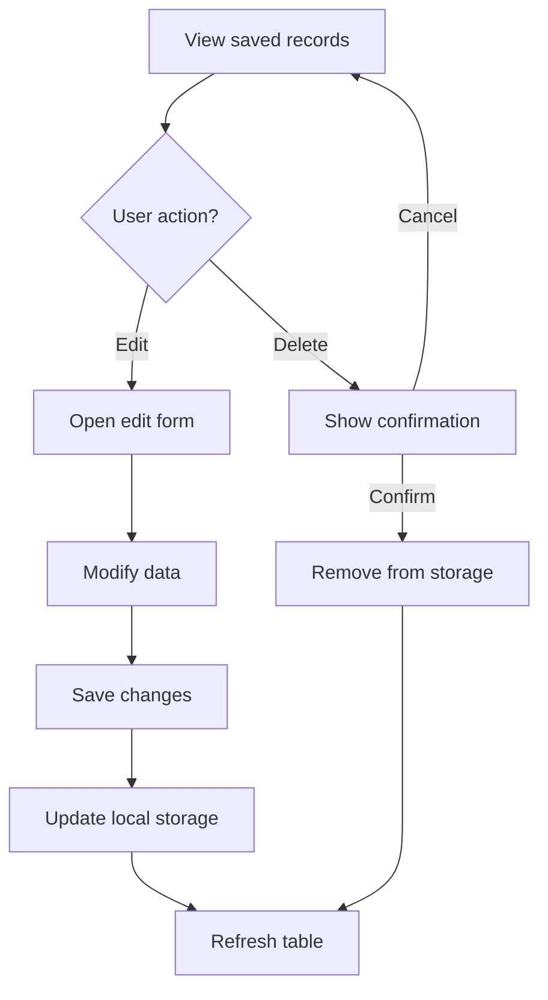

### Map Visualization Workflow

1. **Map Navigation**
   - User navigates to the map tab
   - If a location is selected, map centers on that location
   - Weather information is displayed as an overlay

**Workflow Diagram:**

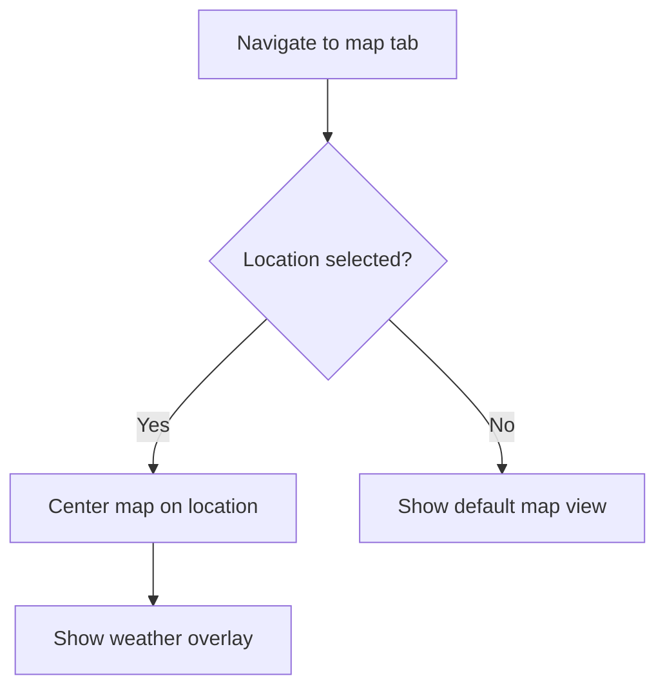

## Data Processing Workflows

### API Data Flow

1. **API Request**
   - Request is formed with location coordinates and API key
   - For demonstration, mock API response is generated
   - In production, requests would go to OpenWeatherMap API

2. **Response Processing**
   - API response is parsed into application's data models
   - Temperature conversion (Kelvin to Celsius/Fahrenheit)
   - Weather condition mapping to icons and background styles

3. **Error Handling**
   - Network errors are caught and displayed to the user
   - Invalid responses trigger error notifications
   - Fallback UI is shown when data is unavailable

**Sequence Diagram:**

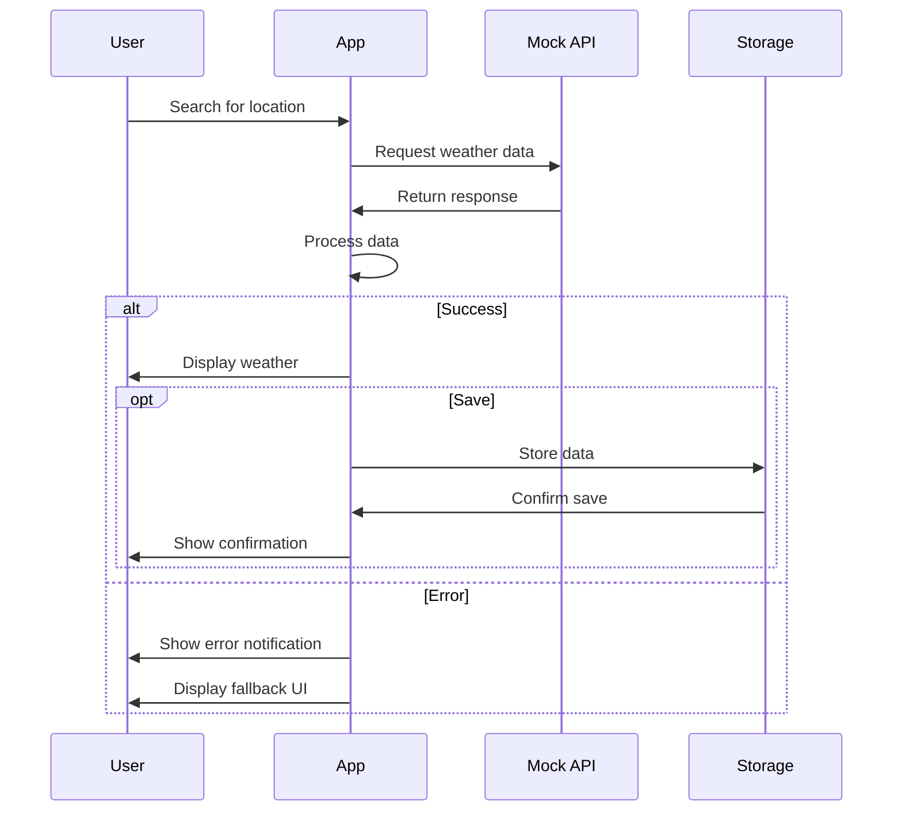

### Data Storage Flow

1. **Data Serialization**
   - Weather data objects are prepared for storage
   - Data is serialized to JSON format
   - Unique IDs are generated for each record

2. **Local Storage Operations**
   - Save: Data is appended to existing records
   - Update: Specific record is modified in place
   - Delete: Record is removed from the collection
   - Retrieve: All records or specific record by ID

3. **Data Export Processing**
   - JSON: Direct serialization of JavaScript objects
   - CSV: Data is transformed into comma-separated values
   - XML: Data is structured in XML format
   - PDF: Data is formatted and rendered as PDF
   - MD: Data is formatted as Markdown tables

**State Diagram:**

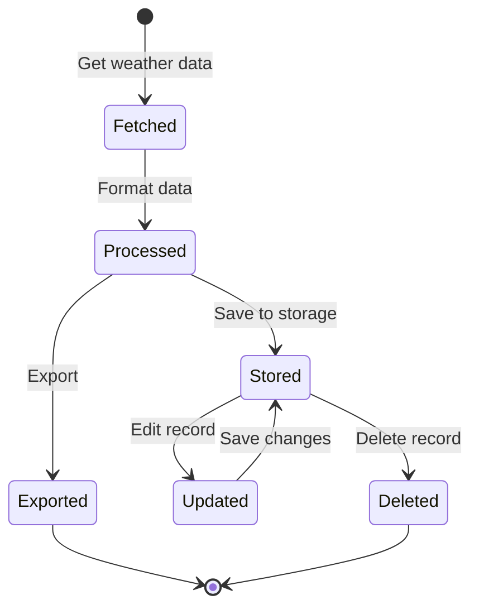

## Component Interaction Workflows

### Parent-Child Component Flow

1. **Index → LocationSearch**
   - Parent passes location selection handler
   - Child returns selected location data
   - Parent updates state with new location

2. **Index → CurrentWeather**
   - Parent passes weather data and save handler
   - Child displays weather information
   - Child triggers save action in parent

3. **Index → WeatherHistory**
   - Parent passes historical data and handlers
   - Child displays data tables and charts
   - Child triggers export actions in parent

**Component Interaction Diagram:**

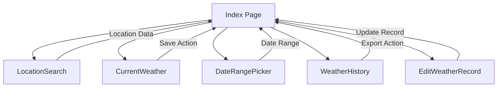

### State Management Flow

1. **User Input → State Update**
   - User interactions trigger state changes
   - React re-renders affected components
   - UI reflects the latest state

2. **API Data → State Update**
   - API responses update application state
   - State changes trigger UI updates
   - Components re-render with new data

3. **Local Storage → State Update**
   - Data retrieved from storage updates state
   - UI reflects the persisted data
   - Changes to storage sync with application state

**Data Flow Diagram:**

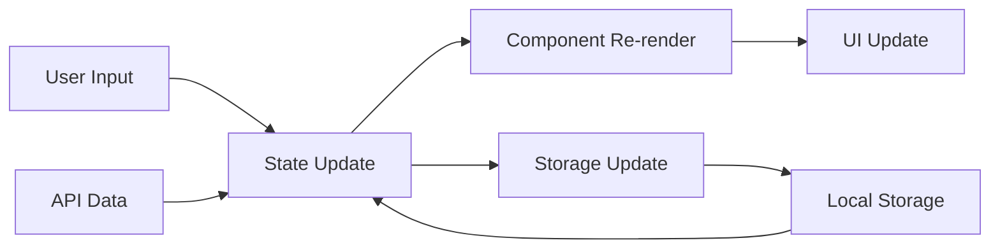

## Development Workflow

### Building New Features

1. **Feature Planning**
   - Define feature requirements and user stories
   - Identify affected components and data structures
   - Plan necessary API interactions

2. **Implementation**
   - Create or modify necessary components
   - Implement API calls and state management
   - Add UI elements and interactions

3. **Testing and Refinement**
   - Test feature functionality
   - Optimize performance
   - Refine user experience

**Development Cycle Diagram:**

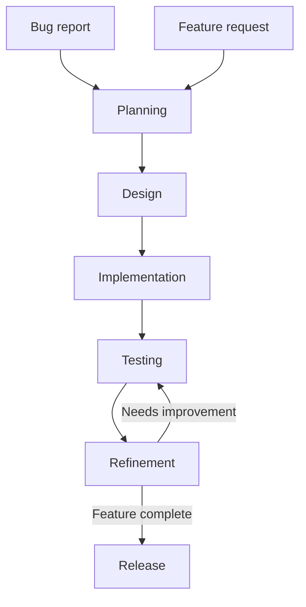

### Component Development Pattern

1. **Define Data Requirements**
   - Identify props and state needed
   - Define TypeScript interfaces

2. **Create Component Structure**
   - Layout component JSX
   - Implement component logic
   - Add styling with Tailwind classes

3. **Connect to Data Sources**
   - Implement API calls or data processing
   - Connect to application state
   - Handle loading and error states

**Component Creation Diagram:**

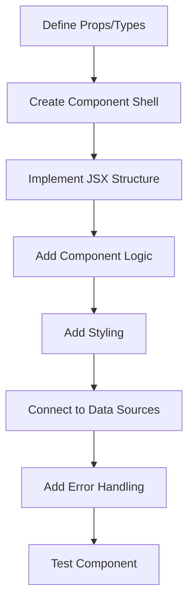

## Deployment Workflow

1. **Build Process**
   - Run `npm run build` to create production build
   - Vite optimizes and bundles code
   - Generated static files ready for deployment

2. **Deployment Options**
   - Static hosting (Netlify, Vercel, GitHub Pages)
   - Container-based deployment
   - Traditional web server hosting

3. **Environment Configuration**
   - Set up API keys for production environment
   - Configure CORS and security settings
   - Set up monitoring and analytics

**Deployment Pipeline Diagram:**

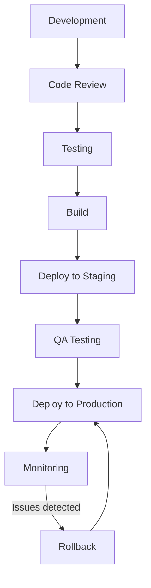

## Architectural Overview

**High-Level Architecture Diagram:**

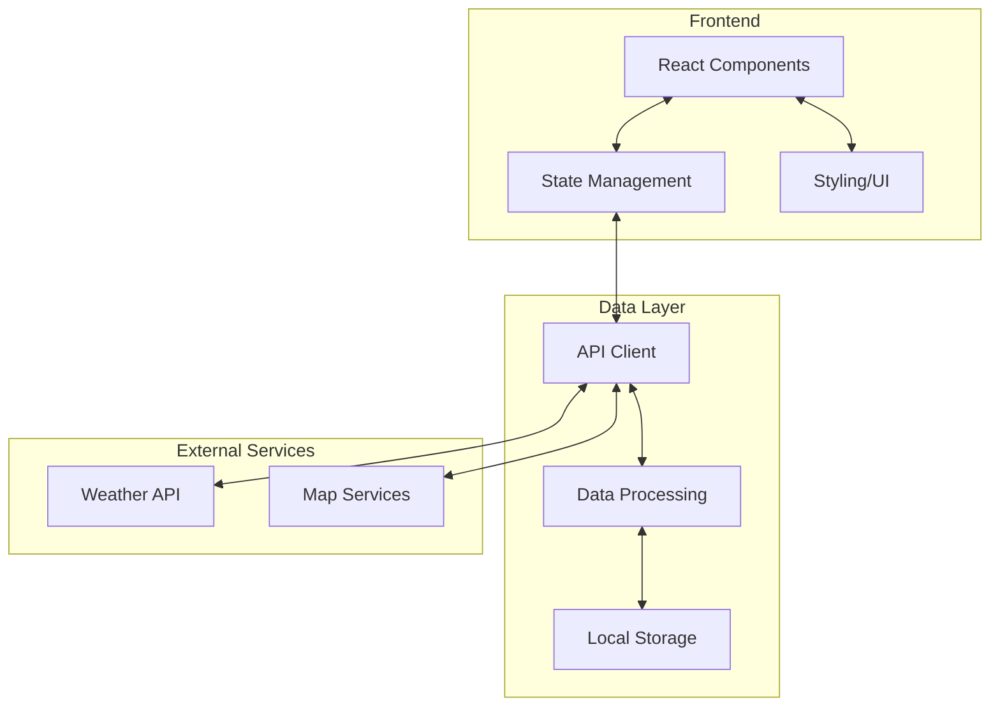

## How to Read These Diagrams

The diagrams in this document are created using Mermaid syntax, which is commonly supported in Markdown renderers. If the diagrams are not rendering properly, consider viewing them with a Markdown viewer that supports Mermaid, or install a Mermaid viewer plugin in your browser or editor.

You can also copy the Mermaid code and paste it into the [Mermaid Live Editor](https://mermaid.live/) to view and edit the diagrams. 